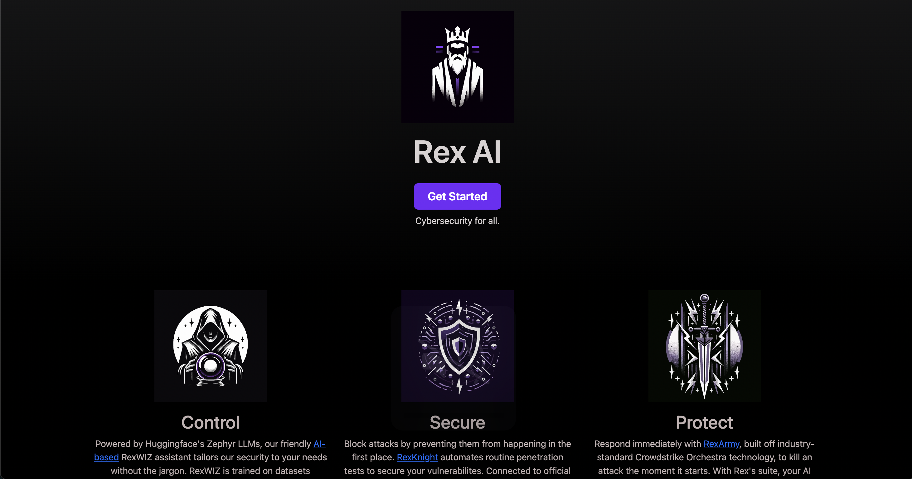

# RexAI on Hugo

Welcome to the website of RexAI, a website which I designed for my Cybersecurity AI-based startup concept in my CIS 3500 class at the University of Pennsylvania. This project involves developing a valuable real-world skill: building a scalable and cost-effective website from scratch using Hugo, a popular open-source static site generator.

You can see it hosted live on GitHub Pages [here!](https://jameshu88.github.io/hugo-mock-landing-page/).

## Learning Objectives

- Work in public, understanding the scrutiny this may invite.
- Quickly familiarize with new web development tools and technologies.
- Ramp up on unfamiliar codebases and technologies through self-directed research.
- Gather functional requirements and draft user stories.
- Develop UI/UX design skills through customization of page layouts and themes and use of DALL-E/other generative AI technologies.
- Gain experience with static site generators and Jamstack technologies.
- Validate designs and functional requirements through prototyping and iteration.
- Publish and host static websites on GitHub Pages.
- Communicate technical concepts through writing and illustration.
- Collaborate through version control and managing shared repository workflows.
